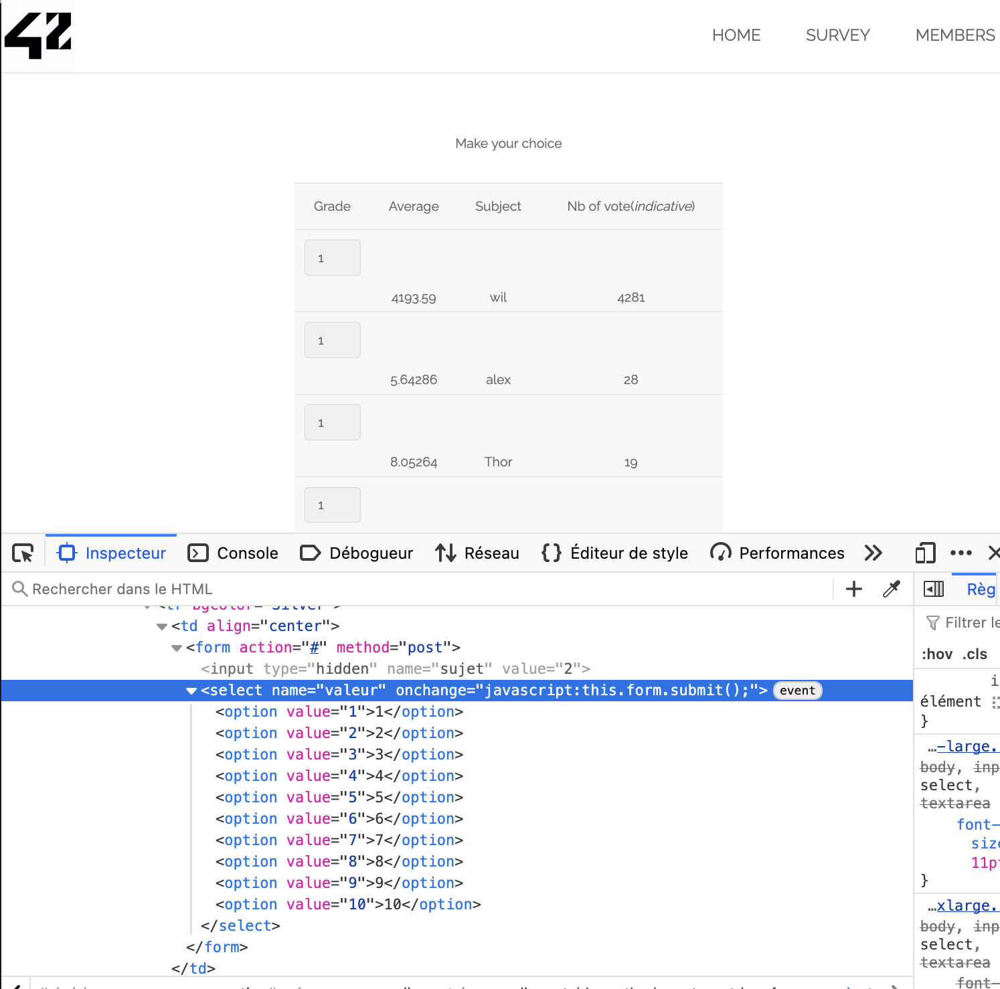
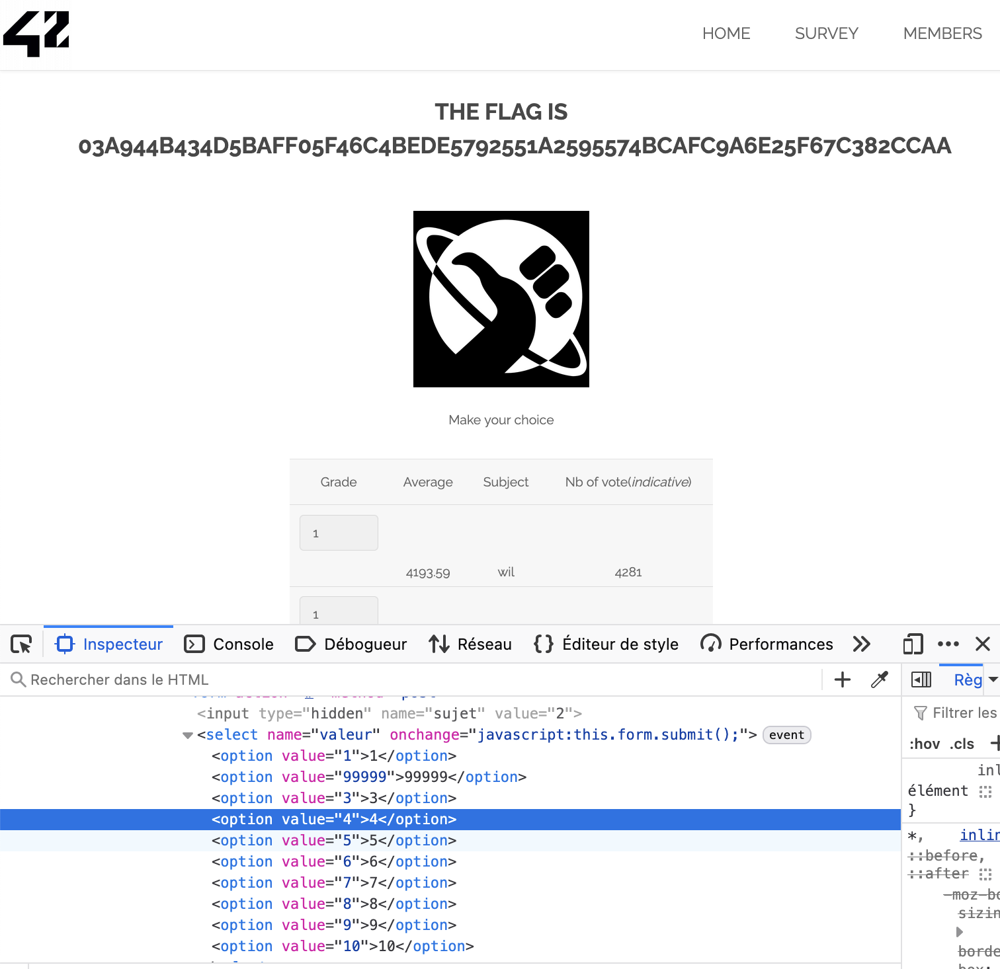

# Injection via Select Option dans le formulaire

## 1. Introduction
J'ai découvert une vulnérabilité liée à la manipulation des valeurs d'un `select` dans un formulaire. Cette faille permet de contourner les restrictions prévues par l'application en injectant des valeurs inattendues dans un champ `select`.

## 2. Comment j'ai trouvé la faille
En inspectant le code HTML du formulaire, j'ai remarqué le code suivant :

```html
<select name="valeur" onchange="javascript:this.form.submit();">
    <option value="1">1</option>
    <option value="2">2</option>
    <option value="3">3</option>
    <option value="4">4</option>
    <option value="5">5</option>
    <option value="6">6</option>
    <option value="7">7</option>
    <option value="8">8</option>
    <option value="9">9</option>
    <option value="10">10</option>
</select>
```

J'ai modifié les `value` dans les DevTools pour tester une valeur inattendue :

```html
<option value="99999">99999</option>
```

En sélectionnant cette option, le formulaire a révélé un **flag** prouvant que le serveur ne valide pas les entrées côté backend.

### **Avant la modification**


### **Après la modification**


## 3. Impact de la faille
Cette vulnérabilité peut avoir plusieurs impacts :
- **Contournement de sécurité** : Permet d'accéder à des données non autorisées.
- **Modification de comportement** : Changer la logique métier prévue par l'application.
- **Injection de données** : Si le champ est utilisé dans une requête SQL, cela peut mener à une injection SQL.

## 4. Exploitation de la faille
Pour exploiter cette faille, il suffit de :
1. **Ouvrir les DevTools (F12)**.
2. **Modifier le HTML** du `select` en ajoutant une valeur inattendue comme `99999`.
3. **Sélectionner cette nouvelle valeur** pour déclencher le `submit()`.

## 5. Comment prévenir cette faille
Pour empêcher cette vulnérabilité, il faut :
- **Valider côté serveur** : Ne jamais faire confiance aux données reçues du client. Vérifier que la valeur reçue est bien dans la liste attendue.
- **Utiliser des valeurs sécurisées** : Utiliser des `value` chiffrées ou hashées.
- **Configurer un Content Security Policy (CSP)** pour limiter l'exécution de scripts non approuvés.

## 6. Comment corriger la faille
Pour corriger cette faille :
- **Vérifier les entrées côté serveur** en utilisant une liste blanche (`whitelist`) des valeurs autorisées :

```php
$allowed_values = ['1', '2', '3', '4', '5', '6', '7', '8', '9', '10'];
if (!in_array($_POST['valeur'], $allowed_values)) {
    die('Valeur non autorisée.');
}
```

- **Éviter l'utilisation directe des entrées utilisateur** dans les requêtes ou la logique métier.
- **Mettre à jour les librairies et frameworks** pour bénéficier des derniers patchs de sécurité.

## 7. Conclusion
J'ai exploité une faille en manipulant un `select` HTML pour soumettre une valeur non prévue par l'application. Cette vulnérabilité montre l'importance de **valider les entrées utilisateur côté serveur**.


