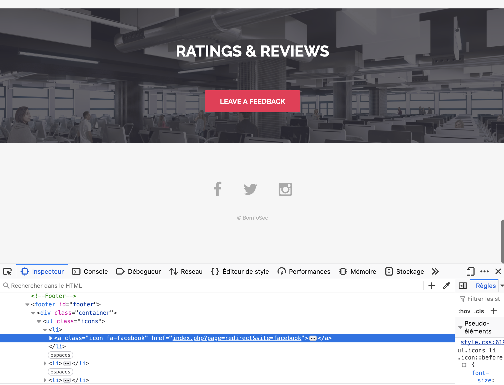
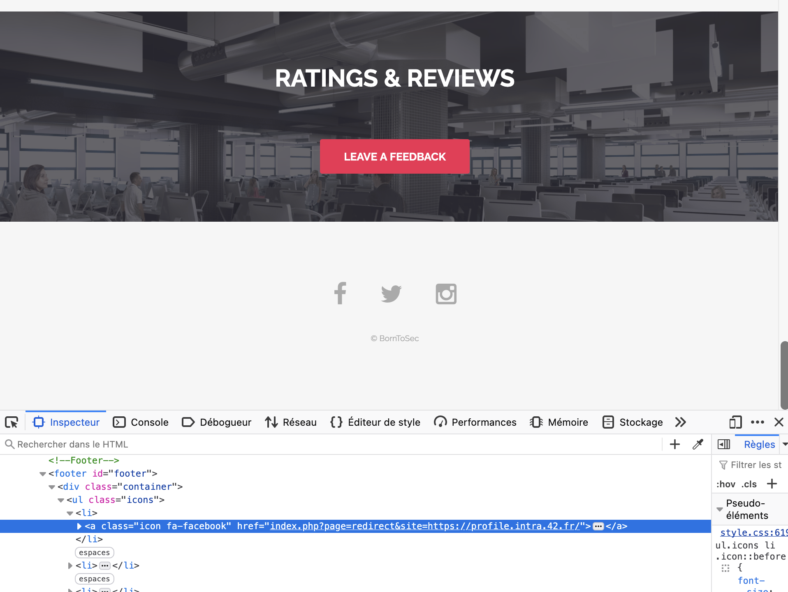
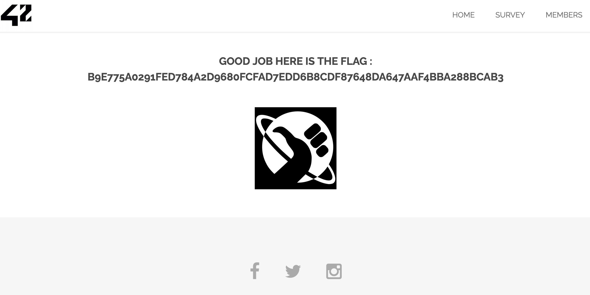

# Exploitation d'une Faille d'Open Redirect

## 📌 Introduction

L'Open Redirect est une vulnérabilité qui permet à un attaquant de rediriger les utilisateurs vers un site malveillant en manipulant une URL de redirection insuffisamment sécurisée.

Dans cette exploitation, j'ai découvert une faille sur **l'URL suivante** :

```bash
http://10.211.55.2/index.php?page=redirect&site=facebook
```

En modifiant le paramètre `site`, j'ai pu rediriger vers n'importe quelle URL externe et obtenir le **flag**.

---

## 🔍 Identification de la faille

1. Dans le **footer** du site, j'ai remarqué un lien :

```html
   <a class="icon fa-facebook" href="index.php?page=redirect&site=facebook"></a>
```



En changeant la valeur du paramètre site, j'ai pu rediriger l'utilisateur vers un autre site.

## 🚀 Exploitation de la faille

### Test initial

J'ai remplacé facebook par une autre URL externe :
```bash
http://10.211.55.2/index.php?page=redirect&site=https://profile.intra.42.fr/
```

**📌 Résultat** : Le site m'a redirigé vers https://profile.intra.42.fr/, confirmant la faille.



### Obtention du flag

J'ai testé plusieurs redirections jusqu'à obtenir le flag en visitant :
```bash
http://10.211.55.2/index.php?page=redirect&site=<valeur_spécifique>
```

**📌 Flag obtenu** :
```bash
B9E775A0291FED784A2D9680FCFAD7EDD6B8CDF87648DA647AAF4BBA288BCAB3
```



## 💥 Impact de la faille

-  **Hameçonnage (Phishing)** : Un attaquant peut tromper un utilisateur en lui faisant croire qu'il visite un site de confiance.
- **Vol de session** : Si la redirection inclut un paramètre contenant un token d'authentification, l'attaquant peut voler des sessions utilisateur.
- **Détournement de navigation** : L'utilisateur peut être redirigé vers une page malveillante contenant du code XSS ou un téléchargeur de malware.

## 🛠️ Comment corriger la faille ?

### ✅ Solution 1 : Filtrer les valeurs autorisées

Restreindre les redirections à une liste blanche de domaines autorisés :
```php
$allowed_sites = [
    "facebook" => "https://www.facebook.com",
    "twitter" => "https://www.twitter.com",
    "instagram" => "https://www.instagram.com"
];

if (isset($_GET['site']) && array_key_exists($_GET['site'], $allowed_sites)) {
    header("Location: " . $allowed_sites[$_GET['site']]);
} else {
    die("Redirection interdite !");
}
```

**📌 Avantage** : Bloque les redirections vers des sites malveillants.

### ✅ Solution 2 : Empêcher les URLs externes

Si la redirection doit rester interne, empêcher les URLs absolues :

```php
if (strpos($_GET['site'], 'http') !== false) {
    die("Redirection externe interdite !");
}
```

**📌 Avantage** : Seules les pages internes peuvent être redirigées.

### ✅ Solution 3 : Utiliser un jeton de validation

Ajouter un jeton CSRF pour éviter les manipulations malveillantes.

## 🎯 Conclusion

J'ai exploité une faille d'Open Redirect pour rediriger vers des URLs externes et obtenir un flag.
L'impact de cette faille est important car elle peut être utilisée pour du phishing ou du vol de session.
Des solutions comme une liste blanche de domaines autorisés ou un blocage des URLs externes permettent de sécuriser cette fonctionnalité.