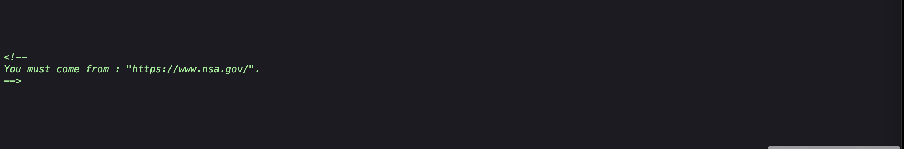
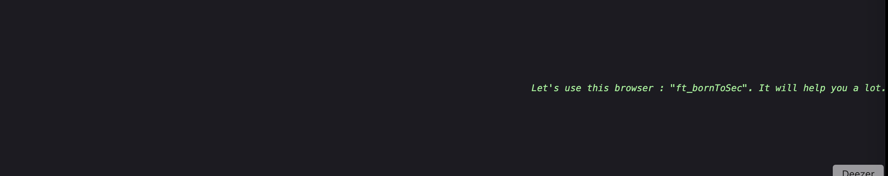
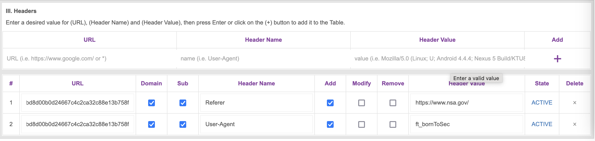
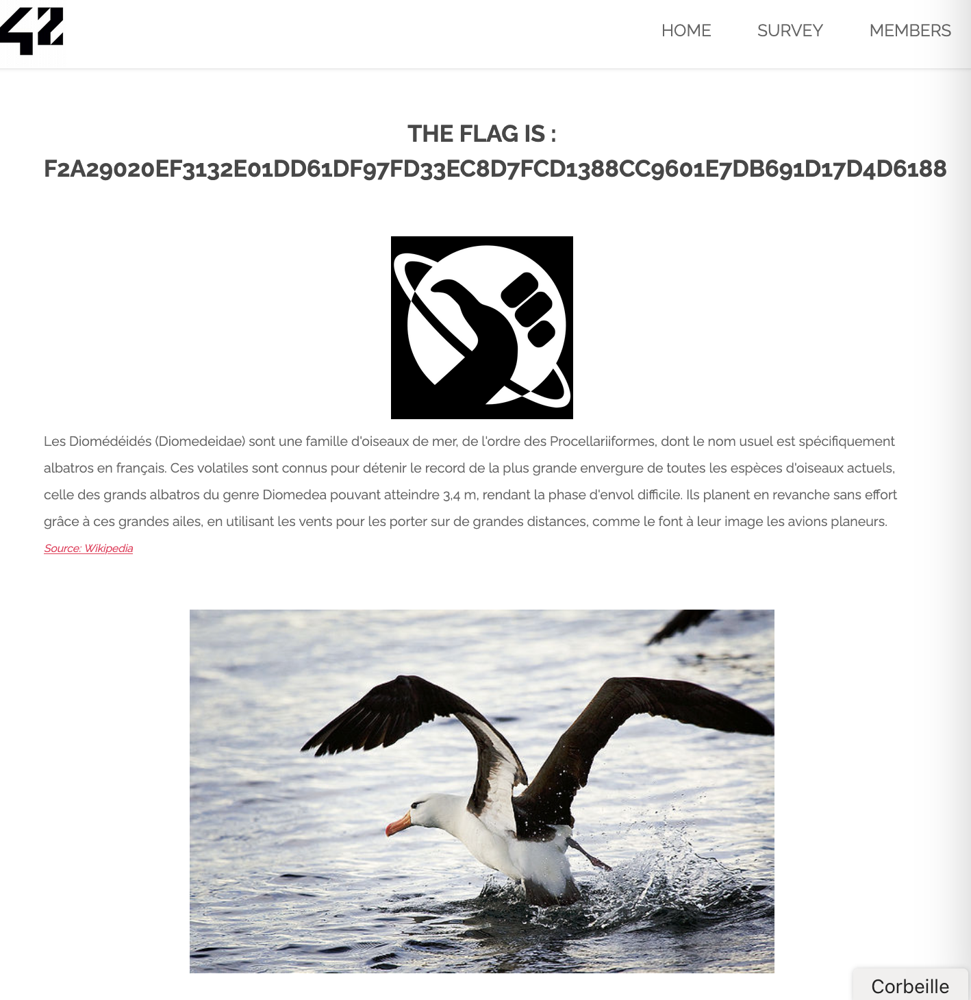

# Exploitation par Analyse du Code Source pour Récupérer le Flag

## 1. Introduction

Dans cette analyse, j'ai trouvé un flag caché en explorant le code source HTML d'une page web. Cette technique consiste à examiner le contenu de la page pour y déceler des indices cachés.

## 2. Exploration du Code Source

En affichant le code source de la page (clic droit > "Afficher le code source de la page" ou `Ctrl + U` sous Windows/Linux, `command + U` sous mac), j'ai repéré des commentaires HTML ainsi que des fichiers potentiellement intéressants.

```html
<!--
Voila un peu de lecture :
Lorem Ipsum is simply dummy text of the printing and typesetting industry...
-->

<!--
You must come from : "https://www.nsa.gov/".
-->


<!--
Let's use this browser : "ft_bornToSec". It will help you a lot.
-->
```





Ces indices m'ont suggéré que la page vérifiait l'agent utilisateur et le référent HTTP.

## 3. Modification des Headers HTTP

J'ai utilisé une extension de navigateur pour modifier les headers HTTP et envoyer les valeurs attendues :

- **Referer** : `https://www.nsa.gov/`
- **User-Agent** : `ft_bornToSec`

Voici comment j'ai procédé avec une extension permettant de modifier les requêtes :

1. Installation de l'extension `ModHeader` (ou une autre extension de modification de requêtes HTTP).
2. Ajout des headers personnalisés.
3. Rechargement de la page ciblée.



## 4. Obtention du Flag

Une fois les headers correctement configurés, j'ai rafraîchi la page et j'ai accédé au flag affiché directement sur la page :

```plaintext
F2A29020EF3132E01DD61DF97FD33EC8D7FCD1388CC9601E7DB691D17D4D6188
```



## 5. Impact de la Faille

Cette faille permet à un attaquant de contourner des protections basées uniquement sur des restrictions côté client, ce qui est une mauvaise pratique de sécurité.

## 6. Comment Prévenir Cette Faille ?

Pour éviter ce type de vulnérabilité, il est recommandé de :

- Ne pas stocker de données sensibles en clair dans le code source.
- Implémenter des vérifications côté serveur.
- Restreindre l'accès aux pages sensibles via des mécanismes d'authentification robustes.
- Logger et surveiller les requêtes suspectes.

## 7. Conclusion

En inspectant le code source et en modifiant les headers HTTP, j'ai pu découvrir une faille de sécurité permettant l'affichage d'un flag caché. Cette expérience illustre l'importance de la sécurité côté serveur et l'inutilité de se fier uniquement à des protections côté client.
