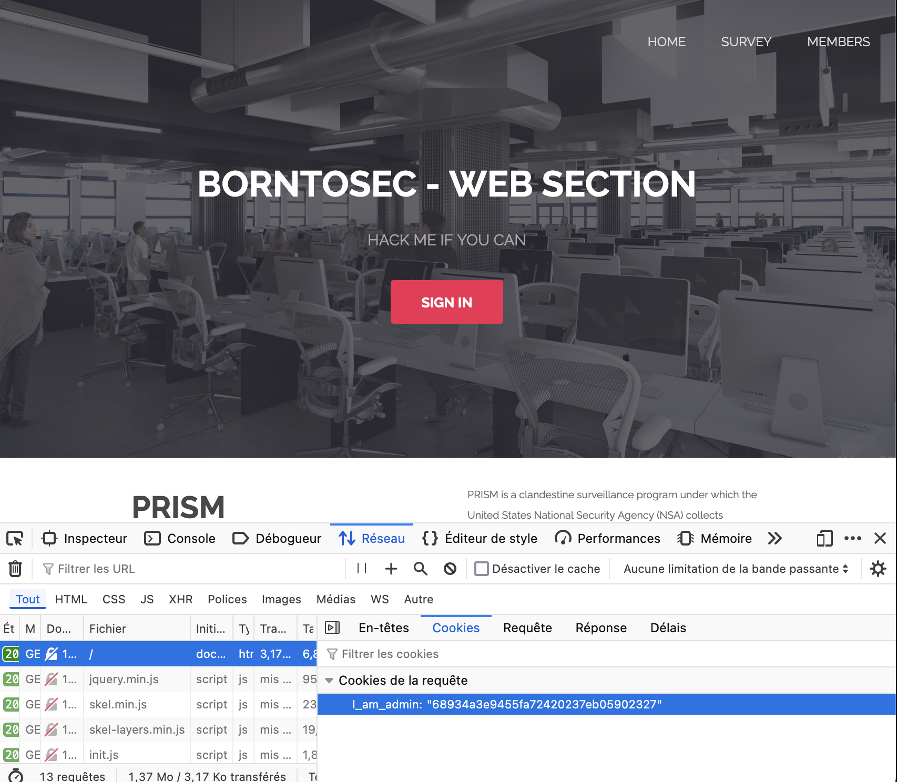
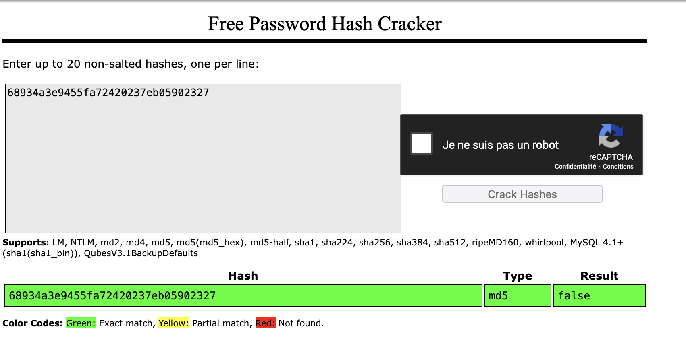

# Session Prediction via Cookie MD5 Hash

## 1. Introduction
J'ai exploité une vulnérabilité de **Session Prediction** en manipulant un cookie nommé `I_am_admin` qui utilise un **hash MD5**. Le site vérifie le statut administrateur à l'aide de ce cookie, mais il utilise une valeur en MD5 qui est prévisible et modifiable.

## 2. Analyse du cookie
En inspectant les cookies avec les DevTools, j'ai trouvé le cookie suivant :

```http
I_am_admin=68934a3e9455fa72420237eb05902327
```



Ce hash correspond au format MD5 suivant l'expression régulière :
```regex
/^[a-fA-F0-9]{32}$/i
```
Cela m'a suggéré qu'il s'agit d'un **hash MD5** et qu'il peut être **décrypté**.

## 3. Décryptage du MD5
J'ai utilisé l'outil [dcode.fr](https://www.dcode.fr) pour décrypter le hash.

### **Décryptage du MD5**
```plaintext
68934a3e9455fa72420237eb05902327 → false
```



J'ai ensuite encodé `true` en MD5 pour tester si le cookie contrôlait le statut administrateur :

### **Encodage de `true` en MD5**
```plaintext
true → b326b5062b2f0e69046810717534cb09
```

## 4. Exploitation de la faille
J'ai utilisé les **DevTools** du navigateur pour modifier le cookie comme suit :
```js
document.cookie = "I_am_admin=b326b5062b2f0e69046810717534cb09";
```

Puis, j'ai rafraîchi la page et j'ai immédiatement eu accès à l'interface administrateur, ce qui m'a permis de **voler la session admin** et de récupérer le **flag**.


## 5. Impact de la faille
Cette vulnérabilité permet à un attaquant de :
- **Prendre le contrôle du compte administrateur** en modifiant simplement le cookie.
- **Contourner les systèmes d'authentification** sans connaître les identifiants.
- **Accéder à des données sensibles** ou exécuter des actions administratives.

## 6. Comment prévenir cette faille
Pour éviter cette vulnérabilité, il faut :
- **Ne jamais utiliser de hash MD5** pour stocker des statuts sensibles dans des cookies.
- Utiliser des **Json Web Tokens (JWT)** pour les sessions, car ils sont signés par le serveur et **ne peuvent pas être falsifiés** sans invalider la signature.
- **Stocker les permissions en base de données** plutôt que dans un cookie ou un token statique.
- Utiliser des **tokens sécurisés et aléatoires** pour les cookies de session (`session_id`) au lieu de valeurs prévisibles.

## 7. Comment corriger la faille
Pour corriger cette faille :
- Remplacer le cookie `I_am_admin` par un **token JWT** sécurisé :
```js
const jwt = require('jsonwebtoken');
const token = jwt.sign({ admin: true }, 'SECRET_KEY', { expiresIn: '1h' });
document.cookie = `I_am_admin=${token}`;
```
- **Vérifier côté serveur** le JWT avec la clé secrète.
- **Ne jamais stocker de permissions** dans un cookie non sécurisé.

## 8. Conclusion
J'ai exploité une **Session Prediction** en manipulant un cookie contenant un hash MD5 prédictible. En changeant la valeur à `true` encodée en MD5, j'ai obtenu un accès administrateur. Cette vulnérabilité démontre l'importance d'utiliser des **JWT signés**, de **ne pas stocker les permissions dans les cookies**, et de **ne jamais utiliser MD5 pour la sécurité**.