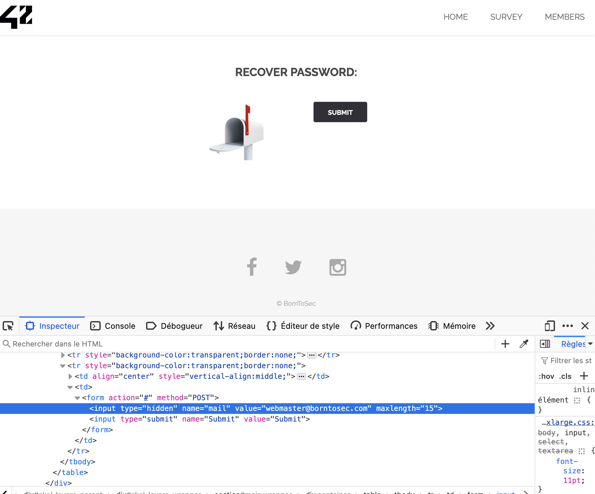
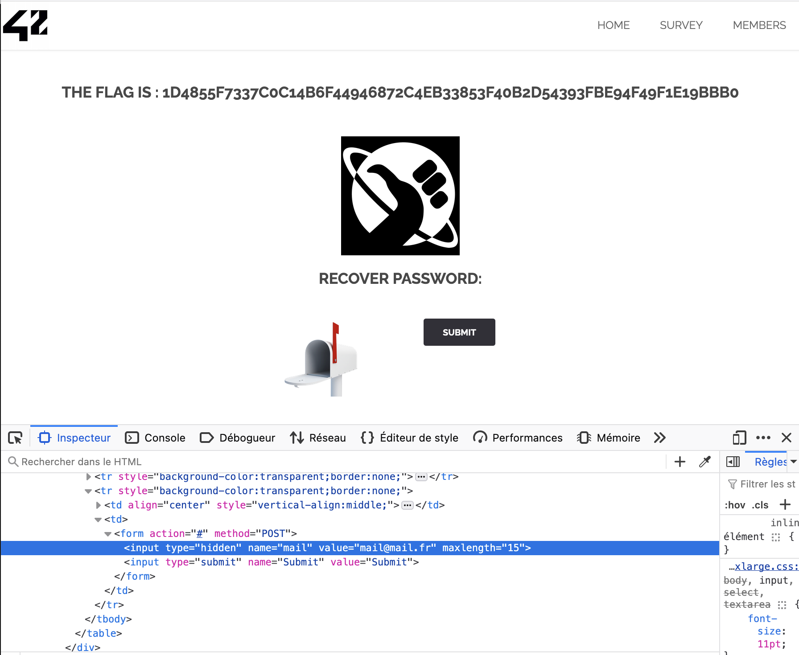

# Manipulation du champ `hidden` pour la récupération de mot de passe

## 1. Introduction
J'ai découvert une faille de sécurité sur la page de récupération de mot de passe, où un **champ hidden** contenant l'adresse email du destinataire du lien de réinitialisation est directement modifiable depuis les DevTools. En modifiant cette valeur, j'ai pu afficher un **flag** en forçant l'envoi du lien à une autre adresse email.

## 2. Comment j'ai trouvé la faille
En analysant le code HTML de la page, j'ai remarqué le champ hidden suivant :

```html
<input type="hidden" name="mail" value="webmaster@borntosec.com" maxlength="15">
```

Ce champ est utilisé pour envoyer automatiquement la réinitialisation de mot de passe à `webmaster@borntosec.com` sans permettre à l'utilisateur de changer l'email.

### **Avant la modification**


## 3. Exploitation de la faille
En utilisant les **DevTools** du navigateur, j'ai simplement modifié le champ hidden comme suit :

```html
<input type="hidden" name="mail" value="mail@mail.fr" maxlength="15">
```

J'ai ensuite cliqué sur le bouton **Submit**. Le serveur a traité la nouvelle valeur sans aucune vérification côté backend, ce qui a permis de générer un **flag** :

```
1D4855F7337C0C14B6F44946872C4EB33853F40B2D54393FBE94F49F1E19BB0
```

### **Après la modification**


## 4. Impact de la faille
Cette vulnérabilité permet à un attaquant de :
- **Changer l'adresse email de réinitialisation** pour n'importe quel compte.
- **Prendre le contrôle du compte** si l'adresse email modifiée est celle de l'administrateur ou d'un autre utilisateur légitime.
- **Contourner la sécurité** prévue pour protéger les comptes.

## 5. Comment prévenir cette faille
Pour empêcher cette vulnérabilité, il faut :
- **Valider côté serveur** la valeur du champ `mail` en vérifiant qu'elle correspond à l'email de l'utilisateur connecté.
- **Ne pas utiliser de champs hidden** pour des données sensibles, comme une adresse email, car ils sont facilement modifiables.
- **Utiliser des tokens sécurisés** stockés en base de données pour valider les demandes de réinitialisation.

## 6. Comment corriger la faille
Pour corriger cette faille :
- **Vérifier côté serveur** que l'email correspond bien à l'utilisateur ayant initié la demande :

```php
if ($_POST['mail'] !== $_SESSION['user_email']) {
    die('Tentative de manipulation détectée !');
}
```
- **Utiliser un formulaire sécurisé** où l'utilisateur doit **saisir manuellement** son adresse email pour recevoir un lien de réinitialisation.

## 7. Conclusion
J'ai exploité une faille de sécurité en modifiant un **champ hidden** contenant l'email du destinataire du lien de réinitialisation. Cette exploitation montre l'importance de **valider les entrées côté serveur**, de **ne pas utiliser de champs hidden pour des données sensibles**, et de **sécuriser les mécanismes de réinitialisation de mot de passe**.


