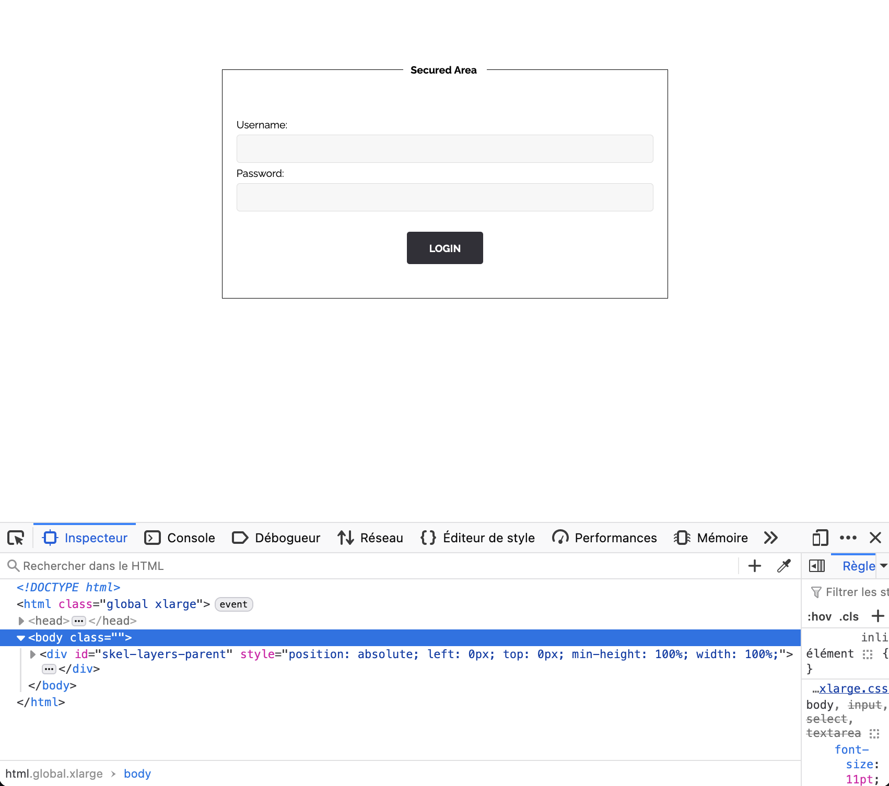
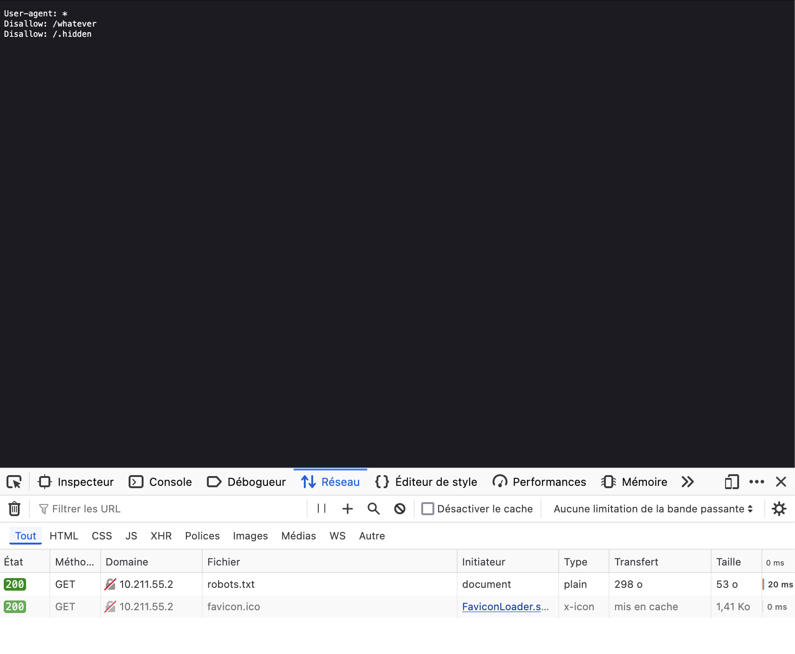
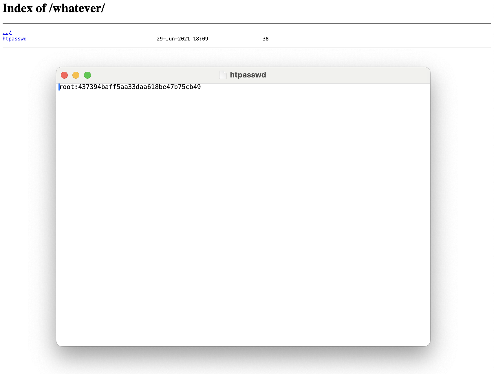
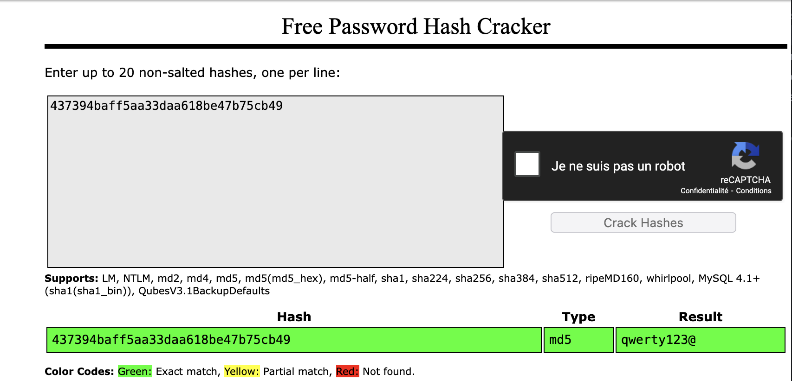

# Exploitation de `.htpasswd` exposé pour accéder à une zone sécurisée

## 1. Introduction
J'ai exploité une faille de sécurité liée à un fichier **.htpasswd** exposé publiquement, contenant un **hash MD5** du mot de passe d'un utilisateur administrateur. En déchiffrant ce hash, j'ai pu accéder à une zone sécurisée et obtenir le **flag**.

## 2. Découverte de la faille
En explorant le fichier `robots.txt`, j'ai trouvé l'indication suivante :

```
User-agent: *
Disallow: /whatever
```



J'ai donc navigué vers l'URL suivante :
```
http://10.211.55.2/whatever/
```
Ce répertoire contenait un fichier `.htpasswd` visible publiquement :

```
Index of /whatever/
- .htpasswd
```



### **Contenu de `.htpasswd`**
En ouvrant le fichier, j'ai trouvé :
```
root:437394baff5aa33daa618be47b75cb49
```
Il s'agit clairement d'un **hash MD5**.



## 3. Décryptage du Hash MD5
J'ai utilisé un outil de décryptage en ligne pour le **hash MD5** trouvé dans `.htpasswd`. Le résultat est le suivant :

```
437394baff5aa33daa618be47b75cb49 → qwerty123@
```

Le mot de passe en clair est donc : **qwerty123@**

### **Capture d'écran du décryptage**



## 4. Exploitation de la faille
En utilisant ce mot de passe, j'ai essayé de me connecter à l'interface administrateur :
```
http://10.211.55.2/admin
```
- **Username** : `root`
- **Password** : `qwerty123@`

### **Succès de la connexion et obtention du Flag**
En utilisant les identifiants trouvés, j'ai accédé à l'interface administrateur et obtenu le **flag** suivant :
```
d19b4823e0d5600ceed56d5e896ef328d7a2b9e7ac7e80f4fcdb9b10bcb3e7ff
```

### **Capture d'écran de la réussite**


## 5. Impact de la faille
Cette faille permet à un attaquant de :
- **Accéder à des zones protégées** de l'application web en utilisant des identifiants exposés.
- **Contourner l'authentification** en déchiffrant un simple MD5.
- **Récupérer des informations sensibles** comme le **flag** ou d'autres données confidentielles.

## 6. Comment prévenir cette faille
Pour éviter cette vulnérabilité :
- **Ne jamais exposer de fichiers `.htpasswd`** sur un serveur public.
- Utiliser un `.htaccess` pour **protéger l'accès** aux répertoires sensibles :
```apache
<Files ".htpasswd">
    Require all denied
</Files>
```
- **Utiliser un chiffrement sécurisé** pour les mots de passe comme **bcrypt** ou **argon2**, au lieu de MD5 qui est facilement déchiffrable.
- **Ne jamais réutiliser des mots de passe sensibles** dans plusieurs services.

## 7. Comment corriger la faille
Pour corriger cette faille :
- Supprimer le fichier `.htpasswd` exposé.
- Changer le mot de passe de l'utilisateur `root` et **utiliser un chiffrement sécurisé**.
- Ajouter une protection via `.htaccess` pour empêcher l'accès direct aux fichiers sensibles.

## 8. Conclusion
J'ai exploité un `.htpasswd` exposé publiquement contenant un **hash MD5** faible pour obtenir un accès administrateur. Cette exploitation démontre l'importance de **ne pas exposer de fichiers sensibles**, d'**utiliser un chiffrement sécurisé** pour les mots de passe, et de **protéger les répertoires sensibles** avec `.htaccess`.
